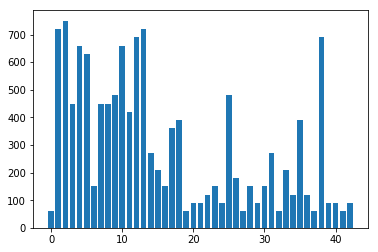
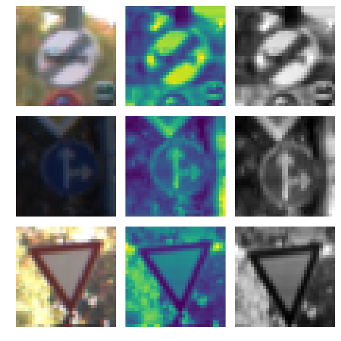
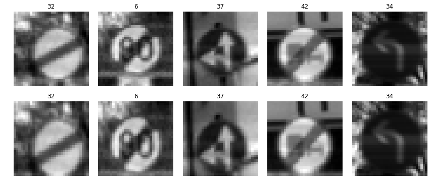
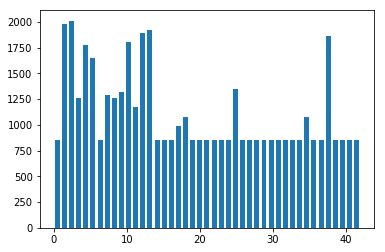
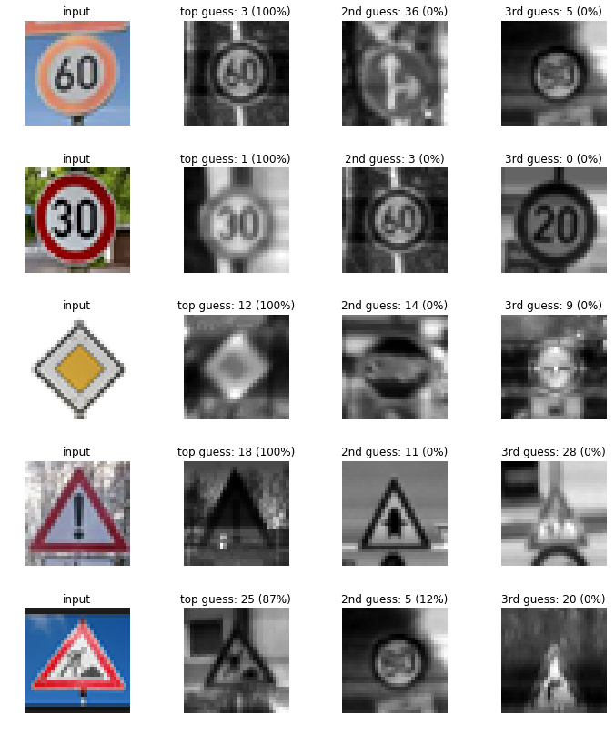

# Self-Driving Car Engineer Nanodegree

## Deep Learning

## Project: Build a Traffic Sign Recognition Classifier

---
## Step 0: Load The Data


```python
# Load pickled data
import pickle
import numpy as np
import cv2
from pylab import array, arange
from sklearn import preprocessing
# TODO: Fill this in based on where you saved the training and testing data
training_file = "traffic-signs-data/train.p"
validation_file= "traffic-signs-data/valid.p"
testing_file = "traffic-signs-data/test.p"

with open(training_file, mode='rb') as f:
    train = pickle.load(f)
with open(validation_file, mode='rb') as f:
    valid = pickle.load(f)
with open(testing_file, mode='rb') as f:
    test = pickle.load(f)
    
X_train, y_train = train['features'], train['labels']
X_valid, y_valid = valid['features'], valid['labels']
X_test, y_test = test['features'], test['labels']
```

---

## Step 1: Dataset Summary & Exploration

The pickled data is a dictionary with 4 key/value pairs:

- `'features'` is a 4D array containing raw pixel data of the traffic sign images, (num examples, width, height, channels).
- `'labels'` is a 1D array containing the label/class id of the traffic sign. The file `signnames.csv` contains id -> name mappings for each id.
- `'sizes'` is a list containing tuples, (width, height) representing the original width and height the image.
- `'coords'` is a list containing tuples, (x1, y1, x2, y2) representing coordinates of a bounding box around the sign in the image. **THESE COORDINATES ASSUME THE ORIGINAL IMAGE. THE PICKLED DATA CONTAINS RESIZED VERSIONS (32 by 32) OF THESE IMAGES**

Complete the basic data summary below. Use python, numpy and/or pandas methods to calculate the data summary rather than hard coding the results. For example, the [pandas shape method](http://pandas.pydata.org/pandas-docs/stable/generated/pandas.DataFrame.shape.html) might be useful for calculating some of the summary results. 

### Provide a Basic Summary of the Data Set Using Python, Numpy and/or Pandas


```python
### Replace each question mark with the appropriate value. 
### Use python, pandas or numpy methods rather than hard coding the results

# TODO: Number of training examples
n_train = len(X_train)

# TODO: Number of validation examples
n_validation = len(X_valid)

# TODO: Number of testing examples.
n_test = len(y_test)

# TODO: What's the shape of an traffic sign image?
image_shape = X_train[0].shape

# TODO: How many unique classes/labels there are in the dataset.
n_classes = len(np.unique(y_train))

print("Number of training examples =", n_train)
print("Number of testing examples =", n_test)
print("Image data shape =", image_shape)
print("Number of classes =", n_classes)
```

    Number of training examples = 38224
    Number of testing examples = 12630
    Image data shape = (32, 32, 1)
    Number of classes = 43
    

### Include an exploratory visualization of the dataset

Visualize the German Traffic Signs Dataset using the pickled file(s). This is open ended, suggestions include: plotting traffic sign images, plotting the count of each sign, etc. 

The [Matplotlib](http://matplotlib.org/) [examples](http://matplotlib.org/examples/index.html) and [gallery](http://matplotlib.org/gallery.html) pages are a great resource for doing visualizations in Python.

**NOTE:** It's recommended you start with something simple first. If you wish to do more, come back to it after you've completed the rest of the sections. It can be interesting to look at the distribution of classes in the training, validation and test set. Is the distribution the same? Are there more examples of some classes than others?

## Visualizing the datasets


```python
### Data exploration visualization code goes here.
### Feel free to use as many code cells as needed.

import matplotlib.pyplot as plt
# Visualizations will be shown in the notebook.
%matplotlib inline
#Runs through the data and creates a graph to display the number of samples per class
#display samples per class for training and testing set
def showAveragePerClass(X_list,y_list,n_classes):
    n_samples_per_class = np.zeros(n_classes)
    repr_class_im = np.zeros((43,32,32))
                             
    for i in range(0,n_classes):
        avg_im = np.zeros((32,32))
        im = np.zeros(image_shape)
        for j in range(0,len(X_list)):
            if(y_list[j] == i):
                n_samples_per_class[i] = n_samples_per_class[i] + 1
                im = np.mean(X_list[j].squeeze(),axis=2)
                avg_im = avg_im + im
    plt.bar(range(43),n_samples_per_class)
    plt.show()
    return n_samples_per_class,repr_class_im

print('Number of Samples in each training class')
n_samples_per_class_train,repr_class_im_train = showAveragePerClass(X_train,y_train,n_classes)
print('Number of Samples in each testing class')
n_samples_per_class_test,repr_class_im_test = showAveragePerClass(X_test,y_test,n_classes)
```

    Number of Samples in each training class
    


    Number of Samples in each testing class
    





----

## Step 2: Design and Test a Model Architecture

Design and implement a deep learning model that learns to recognize traffic signs. Train and test your model on the [German Traffic Sign Dataset](http://benchmark.ini.rub.de/?section=gtsrb&subsection=dataset).

The LeNet-5 implementation shown in the [classroom](https://classroom.udacity.com/nanodegrees/nd013/parts/fbf77062-5703-404e-b60c-95b78b2f3f9e/modules/6df7ae49-c61c-4bb2-a23e-6527e69209ec/lessons/601ae704-1035-4287-8b11-e2c2716217ad/concepts/d4aca031-508f-4e0b-b493-e7b706120f81) at the end of the CNN lesson is a solid starting point. You'll have to change the number of classes and possibly the preprocessing, but aside from that it's plug and play! 

With the LeNet-5 solution from the lecture, you should expect a validation set accuracy of about 0.89. To meet specifications, the validation set accuracy will need to be at least 0.93. It is possible to get an even higher accuracy, but 0.93 is the minimum for a successful project submission. 

There are various aspects to consider when thinking about this problem:

- Neural network architecture (is the network over or underfitting?)
- Play around preprocessing techniques (normalization, rgb to grayscale, etc)
- Number of examples per label (some have more than others).
- Generate fake data.

Here is an example of a [published baseline model on this problem](http://yann.lecun.com/exdb/publis/pdf/sermanet-ijcnn-11.pdf). It's not required to be familiar with the approach used in the paper but, it's good practice to try to read papers like these.

### Pre-process the Data Set (normalization, grayscale, etc.)

Minimally, the image data should be normalized so that the data has mean zero and equal variance. For image data, `(pixel - 128)/ 128` is a quick way to approximately normalize the data and can be used in this project. 

Other pre-processing steps are optional. You can try different techniques to see if it improves performance. 

Use the code cell (or multiple code cells, if necessary) to implement the first step of your project.

### Description of Pre-Processing technique

The Preprocessing technique applied to the dataset involves first converting the image to YUV color space, as described in the article, and then taking only the Y layer from the image.
Next we normalize the dataset using the function provided within sklearn package which results in a mean of 0.163 over the training dataset.


```python
### Preprocess the data here. It is required to normalize the data. Other preprocessing steps could include 
### converting to grayscale, etc.
### Feel free to use as many code cells as needed.

def convertYUV(img):
    res = []
    for x in range(len(img)):
        temp = cv2.cvtColor(img[x], cv2.COLOR_RGB2YUV)
        y, u, v = cv2.split(temp)
        y = preprocessing.normalize(y)
        y.shape = y.shape + (1,)
        res.append(y)   
    return res
    
X_train_rgb = X_train
X_train_normalized = convertYUV(X_train)

X_valid_rgb = X_valid
X_valid_normalized = convertYUV(X_valid)

X_test_rgb = X_test
X_test_normalized = convertYUV(X_test)


X_train = X_train_normalized
X_test = X_test_normalized
X_valid = X_valid_normalized

print("Done YUV conversion and normalization")
```

    C:\Miniconda3\envs\carnd-term1\lib\site-packages\sklearn\utils\validation.py:429: DataConversionWarning: Data with input dtype uint8 was converted to float64 by the normalize function.
      warnings.warn(msg, _DataConversionWarning)
    

    Done YUV conversion and normalization
    

### The new mean of the training dataset


```python
print(np.mean(X_train))
```

    0.163443959602
    

## PreProcess Functions

#### Below I am defining 3 functions that will be used to modify the dataset and create altered images of the base dataset. Creating these new images allows the training to go through a larger amount of data and learn from the different ways that it may encounter the image.

The functions are as follows:

**random_brightness(img)**
    Takes an input image and applies a random brightness change based on the maximum brightness in the image
    
**random_scale_img(img)**
    Randomly scales up the image to a random size between 1.0x and 1.2x    


```python
def random_scale_img(img):
    img2=img.copy()
    sc_y=0.2*np.random.rand()+1.0
    img2=cv2.resize(img, None, fx=1, fy=sc_y, interpolation = cv2.INTER_CUBIC)
    
    dy = int((img2.shape[1]-img.shape[0])/2)
    end = img.shape[1]-dy
    img2 = img2[dy:end,:]
    assert img2.shape[0] == 32
    return img2

def random_brightness(img):
    shifted = img + 1.0   # shift to (0,2) range
    img_max_value = max(shifted.flatten())
    max_coef = 2.0/img_max_value
    min_coef = max_coef - 0.1
    coef = np.random.uniform(min_coef, max_coef)
    dst = shifted * coef - 1.0
    return dst

def transform_img(img):
    img = img.copy()
    
    img = random_brightness(img)
    img = random_scale_img(img)
    img.shape = img.shape + (1,)
    return img
```

### Running the above transform_img(img) function to showcase a few results after processing a few images from the training set


```python
print(transform_img(X_train[100]).shape)
```

    (32, 32, 1)
    


```python
fig, axs = plt.subplots(3,3, figsize=(10, 10))
fig.subplots_adjust(hspace = .1, wspace=.001)
axs = axs.ravel()

#original image 100
img = X_train_rgb[100]
axs[0].axis('off')
axs[0].imshow(img)

#grayscaled image 100
axs[1].axis('off')
axs[1].imshow(X_train[100].squeeze())

#transformed image 100
axs[2].axis('off')
axs[2].imshow(transform_img(X_train[100]).squeeze(), cmap="gray")

#original image 1000
img = X_train_rgb[1000]
axs[3].axis('off')
axs[3].imshow(img)

#grayscaled image 1000
axs[4].axis('off')
axs[4].imshow(X_train[1000].squeeze())

#transformed image 1000
axs[5].axis('off')
axs[5].imshow(transform_img(X_train[1000]).squeeze(),cmap="gray")

#original image 7000
img = X_train_rgb[22222]
axs[6].axis('off')
axs[6].imshow(img)

#grayscaled image 7000
axs[7].axis('off')
axs[7].imshow(X_train[22222].squeeze())

#transformed image 7000
axs[8].axis('off')
axs[8].imshow(transform_img(X_train[22222]).squeeze(), cmap="gray")
```


    <matplotlib.image.AxesImage at 0x196b061b438>





```python
print("len of x train", len(X_train))
print("shape of x train", X_train[0].shape)
print("len of x train normal", len(X_train_normalized))
print("shape of x train normal", X_train_normalized[0].shape)
print("shape after transform img x train", transform_img(X_train[0]).shape)
print("shape after transform img x train normal", transform_img(X_train_normalized[0]).shape)
```

    len of x train 34799
    shape of x train (32, 32, 1)
    len of x train normal 34799
    shape of x train normal (32, 32, 1)
    shape after transform img x train (32, 32, 1)
    shape after transform img x train normal (32, 32, 1)
    

## Create more training data

### Add transformed images(function above) to every class until no class have less than 850 samples


```python
print('X, y shapes:', X_train_normalized[0].shape, y_train.shape)

input_indices = []
output_indices = []

for class_n in range(n_classes):
    class_indices = np.where(y_train == class_n)
    n_samples = len(class_indices[0])
    if n_samples < 850:
        print(class_n, "-> Adding: ", 850-n_samples)
        for i in range(850 - n_samples):
            input_indices.append(class_indices[0][i%n_samples])
            output_indices.append(len(X_train_normalized))
            new_img = X_train_normalized[class_indices[0][i % n_samples]]
            new_img = transform_img(new_img)
            new_img.shape = new_img.shape
            X_train_normalized = np.concatenate((X_train_normalized, [new_img]), axis=0)
            y_train = np.concatenate((y_train, [class_n]), axis=0)
            
print('X, y shapes:', X_train_normalized.shape, y_train.shape)
```

    X, y shapes: (32, 32, 1) (34799,)
    0 -> Adding:  670
    6 -> Adding:  490
    14 -> Adding:  160
    15 -> Adding:  310
    16 -> Adding:  490
    19 -> Adding:  670
    20 -> Adding:  550
    21 -> Adding:  580
    22 -> Adding:  520
    23 -> Adding:  400
    24 -> Adding:  610
    26 -> Adding:  310
    27 -> Adding:  640
    28 -> Adding:  370
    29 -> Adding:  610
    30 -> Adding:  460
    31 -> Adding:  160
    32 -> Adding:  640
    33 -> Adding:  251
    34 -> Adding:  490
    36 -> Adding:  520
    37 -> Adding:  670
    39 -> Adding:  580
    40 -> Adding:  550
    41 -> Adding:  640
    42 -> Adding:  640
    X, y shapes: (47780, 32, 32, 1) (47780,)
    

### Display a few examples from the new dataset


```python
choices = list(range(len(input_indices)))
picks = []
for i in range(5):
    rnd_index = np.random.randint(low=0,high=len(choices))
    picks.append(choices.pop(rnd_index))
fig, axs = plt.subplots(2,5, figsize=(15, 6))
fig.subplots_adjust(hspace = .2, wspace=.001)
axs = axs.ravel()
for i in range(5):
    image = X_train_normalized[input_indices[picks[i]]].squeeze()
    axs[i].axis('off')
    axs[i].imshow(image, cmap = 'gray')
    axs[i].set_title(y_train[input_indices[picks[i]]])
for i in range(5):
    image = X_train_normalized[output_indices[picks[i]]].squeeze()
    axs[i+5].axis('off')
    axs[i+5].imshow(image, cmap = 'gray')
    axs[i+5].set_title(y_train[output_indices[picks[i]]])
```





### Here is what the new training dataset looks like


```python
hist, bins = np.histogram(y_train, bins=n_classes)
width = 0.7 * (bins[1] - bins[0])
center = (bins[:-1] + bins[1:]) / 2
plt.bar(center, hist, align='center', width=width)
plt.show()
```





### Shuffle the training data to make the learning more robust


```python
from sklearn.utils import shuffle

X_train_normalized, y_train = shuffle(X_train_normalized, y_train)

print('done')
```

    done
    

### Branch a section (20%) of the training data to create the validation dataset


```python
from sklearn.model_selection import train_test_split

X_train, X_validation, y_train, y_validation = train_test_split(X_train_normalized, y_train, 
                                                                test_size=0.20, random_state=42)

print("Old X_train size:",len(X_train_normalized))
print("New X_train size:",len(X_train))
print("X_validation size:",len(X_validation))
```

    Old X_train size: 47780
    New X_train size: 38224
    X_validation size: 9556
    

### Model Architecture

#### A modified version of LeNet is the chosen architecture with a mean of 0 and sigma 0.1
#### Number of Epochs is set to 150 with a batch size of 128

The modified LeNet architecture below contains 4 layers, the first 3 being convolutional and the last 1 being fully connected.
It starts with the pre processed image which is a 32,32,1. The outputs of the layers are:

Output layer 1(convolution): 28,28,6

Output Pooling: 14,14,6

Output Layer 2(convolution): 10,10,16

Output Pooling: 5,5,16

Output Layer 3(convolution): 1,1,400

Flattened to an output: 400

Output Layer 4(fully connected): 43


```python
### Define your architecture here.
### Feel free to use as many code cells as needed.

### LeNet function from the class notes, with 100 Epochs and a batch size of 128
import tensorflow as tf
from tensorflow.contrib.layers import flatten
from sklearn.utils import shuffle

EPOCHS = 150
BATCH_SIZE = 128

def LeNet(x):    
    mu = 0
    sigma = 0.1

    # Layer 1: Convolutional. Input = 32x32x1. Output = 28x28x6.
    conv1_W = tf.Variable(tf.truncated_normal(shape=(5, 5, 1, 6), mean = mu, stddev = sigma))
    conv1_b = tf.Variable(tf.zeros(6))
    conv1   = tf.nn.conv2d(x, conv1_W, strides=[1, 1, 1, 1], padding='VALID') + conv1_b

    #  Activation.
    conv1 = tf.nn.relu(conv1)

    # Pooling. Input = 28x28x6. Output = 14x14x6.
    conv1 = tf.nn.max_pool(conv1, ksize=[1, 2, 2, 1], strides=[1, 2, 2, 1], padding='VALID')

    #  Layer 2: Convolutional. Output = 10x10x16.
    conv2_W = tf.Variable(tf.truncated_normal(shape=(5, 5, 6, 16), mean = mu, stddev = sigma))
    conv2_b = tf.Variable(tf.zeros(16))
    conv2   = tf.nn.conv2d(conv1, conv2_W, strides=[1, 1, 1, 1], padding='VALID') + conv2_b
    
    #  Activation.
    conv2 = tf.nn.relu(conv2)

    # Pooling. Input = 10x10x16. Output = 5x5x16.
    conv2 = tf.nn.max_pool(conv2, ksize=[1, 2, 2, 1], strides=[1, 2, 2, 1], padding='VALID')
    
    # TODO: Layer 3: Convolutional. Output = 1x1x400.
    conv3_W = tf.Variable(tf.truncated_normal(shape=(5, 5, 16, 400), mean = mu, stddev = sigma))
    conv3 = tf.nn.conv2d(conv2, conv3_W, strides=[1, 1, 1, 1], padding='VALID')
    conv3_b = tf.Variable(tf.zeros(400))
    
    conv3 = tf.nn.relu(conv3)

    # SFlatten. Input = 1x1x400. Output = 400.
    fc1   = flatten(conv3)

    dr2 = tf.nn.dropout(fc1, dropout) 
    
    #  Layer 5: Fully Connected. Input = 400. Output = 43.
    fc3_W  = tf.Variable(tf.truncated_normal(shape=(400, 43), mean = mu, stddev = sigma))
    fc3_b  = tf.Variable(tf.zeros(43))
    logits = tf.matmul(dr2, fc3_W) + fc3_b

    return logits
```

### Here I start defining the variables for the tensorflow session

x is the placeholder for the images
y is the placeholder for the labels
dropout is used to determine the dropout value in the LeNet function


```python
# x is placeholder for the image data
# y is placeholder for label data
# dropout is the variable used to determine dropout
# one_hot_y holds the result of the built in one hot function
x = tf.placeholder(tf.float32, (None, 32, 32, 1))
y = tf.placeholder(tf.int32, (None))
dropout = tf.placeholder(tf.float32)
one_hot_y = tf.one_hot(y, 43)
```

### The chosen learning rate is 0.0009

#### The built-in tenforflow optimizer AdamOptimizer is the choice of optimizer


```python
rate = 0.0009
#the logits are created through the LeNet function above
logits = LeNet(x)
cross_entropy = tf.nn.softmax_cross_entropy_with_logits(logits=logits,labels=one_hot_y)
loss_operation = tf.reduce_mean(cross_entropy)
optimizer = tf.train.AdamOptimizer(learning_rate = rate)
training_operation = optimizer.minimize(loss_operation)

###
predict_operation = tf.argmax(logits, 1)
predict_proba_operation = tf.nn.softmax(logits=logits)
```

### The evaluate function will be used during the tensorflow sessions to return the accuracy of our network during each epoch, it will call the accuracy_operation function to see how accurate our prediction and it returns the average accuracy over the entire data set.

### The predict function will be used later on the images from the web to return our network's predicted values from which we will extract the top result to see how well the network performs on the new images.


```python
#setting up the evaluate function to be used to check the accuracy of the network
correct_prediction = tf.equal(tf.argmax(logits, 1), tf.argmax(one_hot_y, 1))
accuracy_operation = tf.reduce_mean(tf.cast(correct_prediction, tf.float32))
saver = tf.train.Saver()

def evaluate(X_data, y_data):
    num_examples = len(X_data)
    total_accuracy = 0
    sess = tf.get_default_session()
    for offset in range(0, num_examples, BATCH_SIZE):
        batch_x, batch_y = X_data[offset:offset+BATCH_SIZE], y_data[offset:offset+BATCH_SIZE]
        accuracy = sess.run(accuracy_operation, feed_dict={x: batch_x, y: batch_y, dropout: 1.0})
        total_accuracy += (accuracy * len(batch_x))
    return total_accuracy / num_examples
###
def predict(X_data):
    num_examples = len(X_data)
    sess = tf.get_default_session()
    predicted_proba = list()
    for offset in range(0, num_examples, BATCH_SIZE):
        batch_x = X_data[offset:offset+BATCH_SIZE]
        predicted_proba.extend( sess.run(predict_proba_operation, feed_dict={x: batch_x, dropout: 1.0}))
        
        
    return predicted_proba
```

### Train, Validate and Test the Model

A validation set can be used to assess how well the model is performing. A low accuracy on the training and validation
sets imply underfitting. A high accuracy on the training set but low accuracy on the validation set implies overfitting.


```python
### Train your model here.
### Calculate and report the accuracy on the training and validation set.
### Once a final model architecture is selected, 
### the accuracy on the test set should be calculated and reported as well.
### Feel free to use as many code cells as needed.
with tf.Session() as sess:
    sess.run(tf.global_variables_initializer())
    num_examples = len(X_train)
    
    print("Training...")
    print()
    for i in range(EPOCHS):
        X_train, y_train = shuffle(X_train, y_train)
        for offset in range(0, num_examples, BATCH_SIZE):
            end = offset + BATCH_SIZE
            batch_x, batch_y = X_train[offset:end], y_train[offset:end]
            sess.run(training_operation, feed_dict={x: batch_x, y: batch_y, dropout: 0.5})
        
        training_accuracy = evaluate(X_train, y_train)
        validation_accuracy = evaluate(X_validation, y_validation)
        print("EPOCH {} ...".format(i+1))
        print("Training Accuracy = {:.3f}".format(training_accuracy))
        print("Validation Accuracy = {:.3f}".format(validation_accuracy))
        print()
        
    saver.save(sess, './lenet')
    print("Model saved")
```

    Training...
    
    EPOCH 1 ...
    Training Accuracy = 0.795
    Validation Accuracy = 0.786
    
    EPOCH 2 ...
    Training Accuracy = 0.908
    Validation Accuracy = 0.899
    
    EPOCH 3 ...
    Training Accuracy = 0.939
    Validation Accuracy = 0.929
    
    EPOCH 4 ...
    Training Accuracy = 0.957
    Validation Accuracy = 0.945
    
    EPOCH 5 ...
    Training Accuracy = 0.967
    Validation Accuracy = 0.956
    
    EPOCH 6 ...
    Training Accuracy = 0.975
    Validation Accuracy = 0.964
    
    EPOCH 7 ...
    Training Accuracy = 0.978
    Validation Accuracy = 0.964
    
    EPOCH 8 ...
    Training Accuracy = 0.986
    Validation Accuracy = 0.975
    
    EPOCH 9 ...
    Training Accuracy = 0.988
    Validation Accuracy = 0.976
    
    EPOCH 10 ...
    Training Accuracy = 0.988
    Validation Accuracy = 0.978
    
    EPOCH 11 ...
    Training Accuracy = 0.991
    Validation Accuracy = 0.978
    
    EPOCH 12 ...
    Training Accuracy = 0.993
    Validation Accuracy = 0.983
    
    EPOCH 13 ...
    Training Accuracy = 0.994
    Validation Accuracy = 0.984
    
    EPOCH 14 ...
    Training Accuracy = 0.995
    Validation Accuracy = 0.983
    
    EPOCH 15 ...
    Training Accuracy = 0.995
    Validation Accuracy = 0.983
    
    EPOCH 16 ...
    Training Accuracy = 0.996
    Validation Accuracy = 0.984
    
    EPOCH 17 ...
    Training Accuracy = 0.997
    Validation Accuracy = 0.986
    
    EPOCH 18 ...
    Training Accuracy = 0.997
    Validation Accuracy = 0.987
    
    EPOCH 19 ...
    Training Accuracy = 0.998
    Validation Accuracy = 0.987
    
    EPOCH 20 ...
    Training Accuracy = 0.998
    Validation Accuracy = 0.986
    
    EPOCH 21 ...
    Training Accuracy = 0.999
    Validation Accuracy = 0.989
    
    EPOCH 22 ...
    Training Accuracy = 0.999
    Validation Accuracy = 0.989
    
    EPOCH 23 ...
    Training Accuracy = 0.999
    Validation Accuracy = 0.989
    
    EPOCH 24 ...
    Training Accuracy = 0.999
    Validation Accuracy = 0.990
    
    EPOCH 25 ...
    Training Accuracy = 0.999
    Validation Accuracy = 0.988
    
    EPOCH 26 ...
    Training Accuracy = 0.999
    Validation Accuracy = 0.988
    
    EPOCH 27 ...
    Training Accuracy = 0.999
    Validation Accuracy = 0.991
    
    EPOCH 28 ...
    Training Accuracy = 0.999
    Validation Accuracy = 0.991
    
    EPOCH 29 ...
    Training Accuracy = 0.999
    Validation Accuracy = 0.989
    
    EPOCH 30 ...
    Training Accuracy = 1.000
    Validation Accuracy = 0.990
    
    EPOCH 31 ...
    Training Accuracy = 1.000
    Validation Accuracy = 0.991
    
    EPOCH 32 ...
    Training Accuracy = 0.999
    Validation Accuracy = 0.991
    
    EPOCH 33 ...
    Training Accuracy = 0.999
    Validation Accuracy = 0.990
    
    EPOCH 34 ...
    Training Accuracy = 0.999
    Validation Accuracy = 0.990
    
    EPOCH 35 ...
    Training Accuracy = 1.000
    Validation Accuracy = 0.993
    
    EPOCH 36 ...
    Training Accuracy = 1.000
    Validation Accuracy = 0.992
    
    EPOCH 37 ...
    Training Accuracy = 1.000
    Validation Accuracy = 0.990
    
    EPOCH 38 ...
    Training Accuracy = 1.000
    Validation Accuracy = 0.992
    
    EPOCH 39 ...
    Training Accuracy = 1.000
    Validation Accuracy = 0.992
    
    EPOCH 40 ...
    Training Accuracy = 1.000
    Validation Accuracy = 0.991
    
    EPOCH 41 ...
    Training Accuracy = 1.000
    Validation Accuracy = 0.992
    
    EPOCH 42 ...
    Training Accuracy = 1.000
    Validation Accuracy = 0.991
    
    EPOCH 43 ...
    Training Accuracy = 1.000
    Validation Accuracy = 0.992
    
    EPOCH 44 ...
    Training Accuracy = 1.000
    Validation Accuracy = 0.993
    
    EPOCH 45 ...
    Training Accuracy = 1.000
    Validation Accuracy = 0.993
    
    EPOCH 46 ...
    Training Accuracy = 1.000
    Validation Accuracy = 0.992
    
    EPOCH 47 ...
    Training Accuracy = 1.000
    Validation Accuracy = 0.993
    
    EPOCH 48 ...
    Training Accuracy = 1.000
    Validation Accuracy = 0.993
    
    EPOCH 49 ...
    Training Accuracy = 1.000
    Validation Accuracy = 0.992
    
    EPOCH 50 ...
    Training Accuracy = 1.000
    Validation Accuracy = 0.993
    
    EPOCH 51 ...
    Training Accuracy = 1.000
    Validation Accuracy = 0.994
    
    EPOCH 52 ...
    Training Accuracy = 1.000
    Validation Accuracy = 0.993
    
    EPOCH 53 ...
    Training Accuracy = 1.000
    Validation Accuracy = 0.993
    
    EPOCH 54 ...
    Training Accuracy = 1.000
    Validation Accuracy = 0.992
    
    EPOCH 55 ...
    Training Accuracy = 1.000
    Validation Accuracy = 0.992
    
    EPOCH 56 ...
    Training Accuracy = 1.000
    Validation Accuracy = 0.993
    
    EPOCH 57 ...
    Training Accuracy = 1.000
    Validation Accuracy = 0.994
    
    EPOCH 58 ...
    Training Accuracy = 1.000
    Validation Accuracy = 0.993
    
    EPOCH 59 ...
    Training Accuracy = 1.000
    Validation Accuracy = 0.993
    
    EPOCH 60 ...
    Training Accuracy = 1.000
    Validation Accuracy = 0.994
    
    EPOCH 61 ...
    Training Accuracy = 1.000
    Validation Accuracy = 0.994
    
    EPOCH 62 ...
    Training Accuracy = 1.000
    Validation Accuracy = 0.993
    
    EPOCH 63 ...
    Training Accuracy = 1.000
    Validation Accuracy = 0.992
    
    EPOCH 64 ...
    Training Accuracy = 1.000
    Validation Accuracy = 0.993
    
    EPOCH 65 ...
    Training Accuracy = 1.000
    Validation Accuracy = 0.993
    
    EPOCH 66 ...
    Training Accuracy = 1.000
    Validation Accuracy = 0.993
    
    EPOCH 67 ...
    Training Accuracy = 1.000
    Validation Accuracy = 0.994
    
    EPOCH 68 ...
    Training Accuracy = 1.000
    Validation Accuracy = 0.993
    
    EPOCH 69 ...
    Training Accuracy = 1.000
    Validation Accuracy = 0.994
    
    EPOCH 70 ...
    Training Accuracy = 1.000
    Validation Accuracy = 0.994
    
    EPOCH 71 ...
    Training Accuracy = 1.000
    Validation Accuracy = 0.993
    
    EPOCH 72 ...
    Training Accuracy = 1.000
    Validation Accuracy = 0.994
    
    EPOCH 73 ...
    Training Accuracy = 1.000
    Validation Accuracy = 0.994
    
    EPOCH 74 ...
    Training Accuracy = 1.000
    Validation Accuracy = 0.994
    
    EPOCH 75 ...
    Training Accuracy = 1.000
    Validation Accuracy = 0.993
    
    EPOCH 76 ...
    Training Accuracy = 1.000
    Validation Accuracy = 0.994
    
    EPOCH 77 ...
    Training Accuracy = 1.000
    Validation Accuracy = 0.994
    
    EPOCH 78 ...
    Training Accuracy = 1.000
    Validation Accuracy = 0.995
    
    EPOCH 79 ...
    Training Accuracy = 1.000
    Validation Accuracy = 0.993
    
    EPOCH 80 ...
    Training Accuracy = 1.000
    Validation Accuracy = 0.994
    
    EPOCH 81 ...
    Training Accuracy = 1.000
    Validation Accuracy = 0.994
    
    EPOCH 82 ...
    Training Accuracy = 1.000
    Validation Accuracy = 0.994
    
    EPOCH 83 ...
    Training Accuracy = 1.000
    Validation Accuracy = 0.995
    
    EPOCH 84 ...
    Training Accuracy = 1.000
    Validation Accuracy = 0.994
    
    EPOCH 85 ...
    Training Accuracy = 1.000
    Validation Accuracy = 0.995
    
    EPOCH 86 ...
    Training Accuracy = 1.000
    Validation Accuracy = 0.995
    
    EPOCH 87 ...
    Training Accuracy = 1.000
    Validation Accuracy = 0.995
    
    EPOCH 88 ...
    Training Accuracy = 1.000
    Validation Accuracy = 0.995
    
    EPOCH 89 ...
    Training Accuracy = 1.000
    Validation Accuracy = 0.995
    
    EPOCH 90 ...
    Training Accuracy = 1.000
    Validation Accuracy = 0.995
    
    EPOCH 91 ...
    Training Accuracy = 1.000
    Validation Accuracy = 0.995
    
    EPOCH 92 ...
    Training Accuracy = 1.000
    Validation Accuracy = 0.995
    
    EPOCH 93 ...
    Training Accuracy = 1.000
    Validation Accuracy = 0.995
    
    EPOCH 94 ...
    Training Accuracy = 1.000
    Validation Accuracy = 0.994
    
    EPOCH 95 ...
    Training Accuracy = 1.000
    Validation Accuracy = 0.994
    
    EPOCH 96 ...
    Training Accuracy = 1.000
    Validation Accuracy = 0.994
    
    EPOCH 97 ...
    Training Accuracy = 1.000
    Validation Accuracy = 0.995
    
    EPOCH 98 ...
    Training Accuracy = 1.000
    Validation Accuracy = 0.995
    
    EPOCH 99 ...
    Training Accuracy = 1.000
    Validation Accuracy = 0.994
    
    EPOCH 100 ...
    Training Accuracy = 1.000
    Validation Accuracy = 0.995
    
    EPOCH 101 ...
    Training Accuracy = 1.000
    Validation Accuracy = 0.994
    
    EPOCH 102 ...
    Training Accuracy = 1.000
    Validation Accuracy = 0.993
    
    EPOCH 103 ...
    Training Accuracy = 1.000
    Validation Accuracy = 0.994
    
    EPOCH 104 ...
    Training Accuracy = 1.000
    Validation Accuracy = 0.994
    
    EPOCH 105 ...
    Training Accuracy = 1.000
    Validation Accuracy = 0.994
    
    EPOCH 106 ...
    Training Accuracy = 1.000
    Validation Accuracy = 0.993
    
    EPOCH 107 ...
    Training Accuracy = 1.000
    Validation Accuracy = 0.994
    
    EPOCH 108 ...
    Training Accuracy = 1.000
    Validation Accuracy = 0.994
    
    EPOCH 109 ...
    Training Accuracy = 1.000
    Validation Accuracy = 0.995
    
    EPOCH 110 ...
    Training Accuracy = 1.000
    Validation Accuracy = 0.994
    
    EPOCH 111 ...
    Training Accuracy = 1.000
    Validation Accuracy = 0.995
    
    EPOCH 112 ...
    Training Accuracy = 1.000
    Validation Accuracy = 0.994
    
    EPOCH 113 ...
    Training Accuracy = 1.000
    Validation Accuracy = 0.994
    
    EPOCH 114 ...
    Training Accuracy = 1.000
    Validation Accuracy = 0.994
    
    EPOCH 115 ...
    Training Accuracy = 1.000
    Validation Accuracy = 0.994
    
    EPOCH 116 ...
    Training Accuracy = 1.000
    Validation Accuracy = 0.994
    
    EPOCH 117 ...
    Training Accuracy = 1.000
    Validation Accuracy = 0.994
    
    EPOCH 118 ...
    Training Accuracy = 1.000
    Validation Accuracy = 0.994
    
    EPOCH 119 ...
    Training Accuracy = 1.000
    Validation Accuracy = 0.995
    
    EPOCH 120 ...
    Training Accuracy = 1.000
    Validation Accuracy = 0.995
    
    EPOCH 121 ...
    Training Accuracy = 1.000
    Validation Accuracy = 0.994
    
    EPOCH 122 ...
    Training Accuracy = 1.000
    Validation Accuracy = 0.994
    
    EPOCH 123 ...
    Training Accuracy = 1.000
    Validation Accuracy = 0.993
    
    EPOCH 124 ...
    Training Accuracy = 1.000
    Validation Accuracy = 0.994
    
    EPOCH 125 ...
    Training Accuracy = 1.000
    Validation Accuracy = 0.995
    
    EPOCH 126 ...
    Training Accuracy = 1.000
    Validation Accuracy = 0.994
    
    EPOCH 127 ...
    Training Accuracy = 1.000
    Validation Accuracy = 0.995
    
    EPOCH 128 ...
    Training Accuracy = 1.000
    Validation Accuracy = 0.994
    
    EPOCH 129 ...
    Training Accuracy = 1.000
    Validation Accuracy = 0.995
    
    EPOCH 130 ...
    Training Accuracy = 1.000
    Validation Accuracy = 0.995
    
    EPOCH 131 ...
    Training Accuracy = 1.000
    Validation Accuracy = 0.994
    
    EPOCH 132 ...
    Training Accuracy = 1.000
    Validation Accuracy = 0.995
    
    EPOCH 133 ...
    Training Accuracy = 1.000
    Validation Accuracy = 0.993
    
    EPOCH 134 ...
    Training Accuracy = 1.000
    Validation Accuracy = 0.994
    
    EPOCH 135 ...
    Training Accuracy = 1.000
    Validation Accuracy = 0.994
    
    EPOCH 136 ...
    Training Accuracy = 1.000
    Validation Accuracy = 0.994
    
    EPOCH 137 ...
    Training Accuracy = 1.000
    Validation Accuracy = 0.995
    
    EPOCH 138 ...
    Training Accuracy = 1.000
    Validation Accuracy = 0.995
    
    EPOCH 139 ...
    Training Accuracy = 1.000
    Validation Accuracy = 0.994
    
    EPOCH 140 ...
    Training Accuracy = 1.000
    Validation Accuracy = 0.995
    
    EPOCH 141 ...
    Training Accuracy = 1.000
    Validation Accuracy = 0.995
    
    EPOCH 142 ...
    Training Accuracy = 1.000
    Validation Accuracy = 0.996
    
    EPOCH 143 ...
    Training Accuracy = 1.000
    Validation Accuracy = 0.995
    
    EPOCH 144 ...
    Training Accuracy = 1.000
    Validation Accuracy = 0.995
    
    EPOCH 145 ...
    Training Accuracy = 1.000
    Validation Accuracy = 0.994
    
    EPOCH 146 ...
    Training Accuracy = 1.000
    Validation Accuracy = 0.994
    
    EPOCH 147 ...
    Training Accuracy = 1.000
    Validation Accuracy = 0.994
    
    EPOCH 148 ...
    Training Accuracy = 1.000
    Validation Accuracy = 0.995
    
    EPOCH 149 ...
    Training Accuracy = 1.000
    Validation Accuracy = 0.995
    
    EPOCH 150 ...
    Training Accuracy = 1.000
    Validation Accuracy = 0.995
    
    Model saved
    


```python
with tf.Session() as sess:
    saver.restore(sess, tf.train.latest_checkpoint('.'))

    test_accuracy = evaluate(X_test_normalized, y_test)
    print("Test Accuracy = {:.3f}".format(test_accuracy))
```

    INFO:tensorflow:Restoring parameters from .\lenet
    Test Accuracy = 0.933
    

---

## Step 3: Test a Model on New Images

To give yourself more insight into how your model is working, download at least five pictures of German traffic signs from the web and use your model to predict the traffic sign type.

You may find `signnames.csv` useful as it contains mappings from the class id (integer) to the actual sign name.

### Load and Output the Images


```python
### Load the images and plot them here.
### Feel free to use as many code cells as needed.

import glob
import matplotlib.image as mpimg

fig, axs = plt.subplots(2,5, figsize=(15, 7))
fig.subplots_adjust(hspace = .2, wspace=.001)
axs = axs.ravel()

my_images = []

for i, img in enumerate(glob.glob('./my_images/*.png')):
    image = cv2.imread(img)
    axs[i].axis('off')
    axs[i].imshow(cv2.cvtColor(image, cv2.COLOR_BGR2RGB))
    my_images.append(image)

my_images_normalized = convertYUV(my_images) 

print(my_images_normalized[0].shape)

for i in range(len(my_images_normalized)):
    axs[i+5].axis('off')
    axs[i+5].imshow(my_images_normalized[i].squeeze(), cmap="gray")
    
my_labels = [3,1,12,18,25]
```

    C:\Miniconda3\envs\carnd-term1\lib\site-packages\sklearn\utils\validation.py:429: DataConversionWarning: Data with input dtype uint8 was converted to float64 by the normalize function.
      warnings.warn(msg, _DataConversionWarning)
    

    (32, 32, 1)
    


### Predict the Sign Type for Each Image and Analyze Performance


```python
### Run the predictions here and use the model to output the prediction for each image.
### Make sure to pre-process the images with the same pre-processing pipeline used earlier.
### Feel free to use as many code cells as needed.
softmax_logits = tf.nn.softmax(logits)
top_k = tf.nn.top_k(softmax_logits, k=1)

with tf.Session() as sess:
    sess.run(tf.global_variables_initializer())
    saver3 = tf.train.import_meta_graph('./lenet.meta')
    saver3.restore(sess, "./lenet")
    my_accuracy = evaluate(my_images_normalized, my_labels)
    
    my_top_k = sess.run(top_k, feed_dict={x: my_images_normalized, dropout: 1.0})
    print("Guess for first image(30 km) expected:", my_labels[0], " prediction:", my_top_k[1][0][0])
    print("Guess for second image(wild animal) crossing expected:", my_labels[1], " prediction:", my_top_k[1][1][0])
    print("Guess for third image(no entry) expected:", my_labels[2], " prediction:", my_top_k[1][2][0])
    print("Guess for fourth image(work zone) expected:", my_labels[3], " prediction:", my_top_k[1][3][0])
    print("Guess for fifth image(roundabout) expected:", my_labels[4], " prediction:", my_top_k[1][4][0])
    
    print("My Set Accuracy = {:.3f}".format(my_accuracy))
    print(my_accuracy*100, "%")
```

    INFO:tensorflow:Restoring parameters from ./lenet
    Guess for first image(30 km) expected: 3  prediction: 3
    Guess for second image(wild animal) crossing expected: 1  prediction: 1
    Guess for third image(no entry) expected: 12  prediction: 12
    Guess for fourth image(work zone) expected: 18  prediction: 18
    Guess for fifth image(roundabout) expected: 25  prediction: 25
    My Set Accuracy = 1.000
    100.0 %
    

#### Running another test on an image with dark background


```python
my_imgs = []


image = cv2.imread('./my_images/image2/animal_img_2.png')
image = cv2.cvtColor(image, cv2.COLOR_BGR2RGB)
plt.imshow(image)
print(image.shape)
my_imgs.append(image)

my_imgs = np.asarray(my_imgs)
my_images_gry2 = np.sum(my_imgs/3, axis=3, keepdims=True)

my_images_normalized2 = (my_images_gry2 - 128)/128
print(my_images_normalized2.shape)
my_labels = [31]

softmax_logits = tf.nn.softmax(logits)
top_k = tf.nn.top_k(softmax_logits, k=1)

with tf.Session() as sess:
    sess.run(tf.global_variables_initializer())
    saver3 = tf.train.import_meta_graph('./lenet.meta')
    saver3.restore(sess, "./lenet")
    my_accuracy = evaluate(my_images_normalized2, my_labels)
    
    my_top_k = sess.run(top_k, feed_dict={x: my_images_normalized2, dropout: 1.0})
    print("Guess for first image(wild animal crossing) expected:", my_labels[0], " prediction:", my_top_k[1][0][0])
    
    print("My Set Accuracy = {:.3f}".format(my_accuracy))
    print(my_accuracy*100, "%")
```

    (32, 32, 3)
    (1, 32, 32, 1)
    INFO:tensorflow:Restoring parameters from ./lenet
    Guess for first image(wild animal crossing) expected: 31  prediction: 31
    My Set Accuracy = 1.000
    100.0 %
    


### Output Top 5 Softmax Probabilities For Each Image Found on the Web

For each of the new images, print out the model's softmax probabilities to show the **certainty** of the model's predictions (limit the output to the top 5 probabilities for each image). [`tf.nn.top_k`](https://www.tensorflow.org/versions/r0.12/api_docs/python/nn.html#top_k) could prove helpful here. 

The example below demonstrates how tf.nn.top_k can be used to find the top k predictions for each image.

`tf.nn.top_k` will return the values and indices (class ids) of the top k predictions. So if k=3, for each sign, it'll return the 3 largest probabilities (out of a possible 43) and the correspoding class ids.

Take this numpy array as an example. The values in the array represent predictions. The array contains softmax probabilities for five candidate images with six possible classes. `tf.nn.top_k` is used to choose the three classes with the highest probability:

```
# (5, 6) array
a = np.array([[ 0.24879643,  0.07032244,  0.12641572,  0.34763842,  0.07893497,
         0.12789202],
       [ 0.28086119,  0.27569815,  0.08594638,  0.0178669 ,  0.18063401,
         0.15899337],
       [ 0.26076848,  0.23664738,  0.08020603,  0.07001922,  0.1134371 ,
         0.23892179],
       [ 0.11943333,  0.29198961,  0.02605103,  0.26234032,  0.1351348 ,
         0.16505091],
       [ 0.09561176,  0.34396535,  0.0643941 ,  0.16240774,  0.24206137,
         0.09155967]])
```

Running it through `sess.run(tf.nn.top_k(tf.constant(a), k=3))` produces:

```
TopKV2(values=array([[ 0.34763842,  0.24879643,  0.12789202],
       [ 0.28086119,  0.27569815,  0.18063401],
       [ 0.26076848,  0.23892179,  0.23664738],
       [ 0.29198961,  0.26234032,  0.16505091],
       [ 0.34396535,  0.24206137,  0.16240774]]), indices=array([[3, 0, 5],
       [0, 1, 4],
       [0, 5, 1],
       [1, 3, 5],
       [1, 4, 3]], dtype=int32))
```

Looking just at the first row we get `[ 0.34763842,  0.24879643,  0.12789202]`, you can confirm these are the 3 largest probabilities in `a`. You'll also notice `[3, 0, 5]` are the corresponding indices.

### The code bit below shows the guesses our network had for each of the images found on the web for traffic signs. 
### Using the softmax and top_k functions we extract the top 3 guesses and display them next to the original image. The network is 100% sure on all but one image where it places the probability at 99%.


```python
### Print out the top five softmax probabilities for the predictions on the German traffic sign images found on the web. 
### Feel free to use as many code cells as needed.

softmax_logits = tf.nn.softmax(logits)
top_k = tf.nn.top_k(softmax_logits, k=3)


with tf.Session() as sess:
    sess.run(tf.global_variables_initializer())
    saver = tf.train.import_meta_graph('./lenet.meta')
    saver.restore(sess, "./lenet")
    my_softmax_logits = sess.run(softmax_logits, feed_dict={x: my_images_normalized, dropout: 1.0})
    my_top_k = sess.run(top_k, feed_dict={x: my_images_normalized, dropout: 1.0})

    
    fig, axs = plt.subplots(len(my_images),4, figsize=(12, 14))
    fig.subplots_adjust(hspace = .4, wspace=.2)
    axs = axs.ravel()

    for i, image in enumerate(my_images):
        axs[4*i].axis('off')
        axs[4*i].imshow(cv2.cvtColor(image, cv2.COLOR_BGR2RGB))
        axs[4*i].set_title('input')
        guess1 = my_top_k[1][i][0]
        index1 = np.argwhere(y_validation == guess1)[0]
        axs[4*i+1].axis('off')
        axs[4*i+1].imshow(X_validation[index1].squeeze(), cmap='gray')
        axs[4*i+1].set_title('top guess: {} ({:.0f}%)'.format(guess1, 100*my_top_k[0][i][0]))
        guess2 = my_top_k[1][i][1]
        index2 = np.argwhere(y_validation == guess2)[0]
        axs[4*i+2].axis('off')
        axs[4*i+2].imshow(X_validation[index2].squeeze(), cmap='gray')
        axs[4*i+2].set_title('2nd guess: {} ({:.0f}%)'.format(guess2, 100*my_top_k[0][i][1]))
        guess3 = my_top_k[1][i][2]
        index3 = np.argwhere(y_validation == guess3)[0]
        axs[4*i+3].axis('off')
        axs[4*i+3].imshow(X_validation[index3].squeeze(), cmap='gray')
        axs[4*i+3].set_title('3rd guess: {} ({:.0f}%)'.format(guess3, 100*my_top_k[0][i][2]))
```

    INFO:tensorflow:Restoring parameters from ./lenet
    




