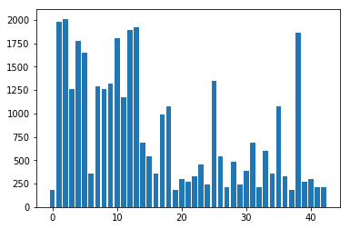
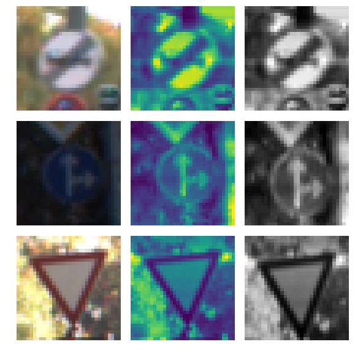
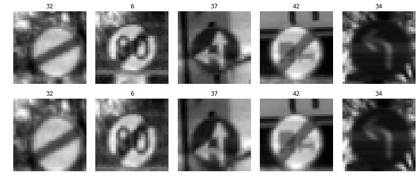
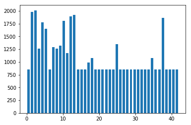
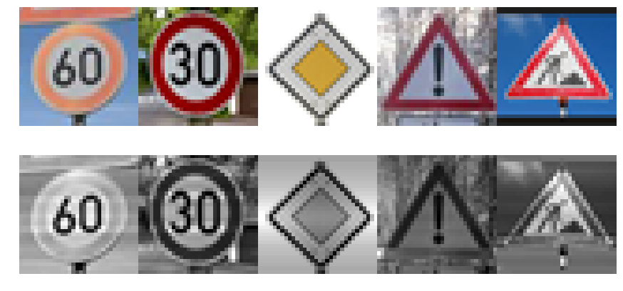
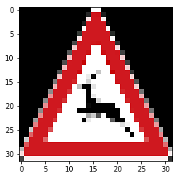

# Self-Driving Car Engineer Nanodegree

## Deep Learning

## Project: Build a Traffic Sign Recognition Classifier


## Step 1: Dataset Summary & Exploration

### Provide a Basic Summary of the Data Set Using Python, Numpy and/or Pandas

```python

# TODO: Number of training examples
n_train = len(X_train)

# TODO: Number of validation examples
n_validation = len(X_valid)

# TODO: Number of testing examples.
n_test = len(y_test)

# TODO: What's the shape of an traffic sign image?
image_shape = X_train[0].shape

# TODO: How many unique classes/labels there are in the dataset.
n_classes = len(np.unique(y_train))

print("Number of training examples =", n_train)
print("Number of testing examples =", n_test)
print("Image data shape =", image_shape)
print("Number of classes =", n_classes)
```

    Number of training examples = 38224
    Number of testing examples = 12630
    Image data shape = (32, 32, 1)
    Number of classes = 43
    
## Visualizing the datasets

### Data exploration visualization code goes here.

    Number of Samples in each training class
    





    Number of Samples in each testing class
    


----

## Step 2: Design and Test a Model Architecture

### Pre-process the Data Set (normalization, grayscale, etc.)

Minimally, the image data should be normalized so that the data has mean zero and equal variance. For image data, `(pixel - 128)/ 128` is a quick way to approximately normalize the data and can be used in this project. 

Other pre-processing steps are optional. You can try different techniques to see if it improves performance. 

Use the code cell (or multiple code cells, if necessary) to implement the first step of your project.

### Description of Pre-Processing technique

The Preprocessing technique applied to the dataset involves first converting the image to YUV color space, as described in the article, and then taking only the Y layer from the image.
Next we normalize the dataset using the function provided within sklearn package which results in a mean of 0.163 over the training dataset.


```python
### Preprocess the data here. It is required to normalize the data. Other preprocessing steps could include 
### converting to grayscale, etc.
### Feel free to use as many code cells as needed.

def convertYUV(img):
    res = []
    for x in range(len(img)):
        temp = cv2.cvtColor(img[x], cv2.COLOR_RGB2YUV)
        y, u, v = cv2.split(temp)
        y = preprocessing.normalize(y)
        y.shape = y.shape + (1,)
        res.append(y)   
    return res

```   

### The new mean of the training dataset

```python
print(np.mean(X_train))
```

    0.163443959602
    

## PreProcess Functions

#### Below I am defining 3 functions that will be used to modify the dataset and create altered images of the base dataset. Creating these new images allows the training to go through a larger amount of data and learn from the different ways that it may encounter the image.

The functions are as follows:

**random_brightness(img)**
    Takes an input image and applies a random brightness change based on the maximum brightness in the image
    
**random_scale_img(img)**
    Randomly scales up the image to a random size between 1.0x and 1.2x    


```python
def random_scale_img(img):
    img2=img.copy()
    sc_y=0.2*np.random.rand()+1.0
    img2=cv2.resize(img, None, fx=1, fy=sc_y, interpolation = cv2.INTER_CUBIC)
    
    dy = int((img2.shape[1]-img.shape[0])/2)
    end = img.shape[1]-dy
    img2 = img2[dy:end,:]
    assert img2.shape[0] == 32
    return img2

def random_brightness(img):
    shifted = img + 1.0   # shift to (0,2) range
    img_max_value = max(shifted.flatten())
    max_coef = 2.0/img_max_value
    min_coef = max_coef - 0.1
    coef = np.random.uniform(min_coef, max_coef)
    dst = shifted * coef - 1.0
    return dst

def transform_img(img):
    img = img.copy()
    
    img = random_brightness(img)
    img = random_scale_img(img)
    img.shape = img.shape + (1,)
    return img
```

### Running the above transform_img(img) function to showcase a few results after processing a few images from the training set    
## A few examples of transformed images from the dataset


    <matplotlib.image.AxesImage at 0x196b061b438>





## Create more training data

### Add transformed images(function above) to every class until no class have less than 850 samples


```python
print('X, y shapes:', X_train_normalized[0].shape, y_train.shape)

input_indices = []
output_indices = []

for class_n in range(n_classes):
    class_indices = np.where(y_train == class_n)
    n_samples = len(class_indices[0])
    if n_samples < 850:
        print(class_n, "-> Adding: ", 850-n_samples)
        for i in range(850 - n_samples):
            input_indices.append(class_indices[0][i%n_samples])
            output_indices.append(len(X_train_normalized))
            new_img = X_train_normalized[class_indices[0][i % n_samples]]
            new_img = transform_img(new_img)
            new_img.shape = new_img.shape
            X_train_normalized = np.concatenate((X_train_normalized, [new_img]), axis=0)
            y_train = np.concatenate((y_train, [class_n]), axis=0)
            
print('X, y shapes:', X_train_normalized.shape, y_train.shape)
```
    

### Display a few examples from the new dataset





### Here is what the new training dataset graph looks like





### Shuffle the training data to make the learning more robust


```python
from sklearn.utils import shuffle

X_train_normalized, y_train = shuffle(X_train_normalized, y_train)

print('done')
```    

### Branch a section (20%) of the training data to create the validation dataset


```python
from sklearn.model_selection import train_test_split

X_train, X_validation, y_train, y_validation = train_test_split(X_train_normalized, y_train, 
                                                                test_size=0.20, random_state=42)

print("Old X_train size:",len(X_train_normalized))
print("X_validation size:",len(X_validation))
```
    X_validation size: 9556
    

### Model Architecture

#### A modified version of LeNet is the chosen architecture with a mean of 0 and sigma 0.1
#### Number of Epochs is set to 150 with a batch size of 128

The modified LeNet architecture below contains 4 layers, the first 3 being convolutional and the last 1 being fully connected.
It starts with the pre processed image which is a 32,32,1. The outputs of the layers are:

Output layer 1(convolution): 28,28,6

Output Pooling: 14,14,6

Output Layer 2(convolution): 10,10,16

Output Pooling: 5,5,16

Output Layer 3(convolution): 1,1,400

Flattened to an output: 400

Output Layer 4(fully connected): 43


```python

### Modified LeNet function from the class notes, with 150 Epochs and a batch size of 128
import tensorflow as tf
from tensorflow.contrib.layers import flatten
from sklearn.utils import shuffle

EPOCHS = 150
BATCH_SIZE = 128

def LeNet(x):    
    mu = 0
    sigma = 0.1

    # Layer 1: Convolutional. Input = 32x32x1. Output = 28x28x6.
    conv1_W = tf.Variable(tf.truncated_normal(shape=(5, 5, 1, 6), mean = mu, stddev = sigma))
    conv1_b = tf.Variable(tf.zeros(6))
    conv1   = tf.nn.conv2d(x, conv1_W, strides=[1, 1, 1, 1], padding='VALID') + conv1_b

    #  Activation.
    conv1 = tf.nn.relu(conv1)

    # Pooling. Input = 28x28x6. Output = 14x14x6.
    conv1 = tf.nn.max_pool(conv1, ksize=[1, 2, 2, 1], strides=[1, 2, 2, 1], padding='VALID')

    #  Layer 2: Convolutional. Output = 10x10x16.
    conv2_W = tf.Variable(tf.truncated_normal(shape=(5, 5, 6, 16), mean = mu, stddev = sigma))
    conv2_b = tf.Variable(tf.zeros(16))
    conv2   = tf.nn.conv2d(conv1, conv2_W, strides=[1, 1, 1, 1], padding='VALID') + conv2_b
    
    #  Activation.
    conv2 = tf.nn.relu(conv2)

    # Pooling. Input = 10x10x16. Output = 5x5x16.
    conv2 = tf.nn.max_pool(conv2, ksize=[1, 2, 2, 1], strides=[1, 2, 2, 1], padding='VALID')
    
    # TODO: Layer 3: Convolutional. Output = 1x1x400.
    conv3_W = tf.Variable(tf.truncated_normal(shape=(5, 5, 16, 400), mean = mu, stddev = sigma))
    conv3 = tf.nn.conv2d(conv2, conv3_W, strides=[1, 1, 1, 1], padding='VALID')
    conv3_b = tf.Variable(tf.zeros(400))
    
    conv3 = tf.nn.relu(conv3)

    # SFlatten. Input = 1x1x400. Output = 400.
    fc1   = flatten(conv3)

    dr2 = tf.nn.dropout(fc1, dropout) 
    
    #  Layer 5: Fully Connected. Input = 400. Output = 43.
    fc3_W  = tf.Variable(tf.truncated_normal(shape=(400, 43), mean = mu, stddev = sigma))
    fc3_b  = tf.Variable(tf.zeros(43))
    logits = tf.matmul(dr2, fc3_W) + fc3_b

    return logits
```

### Here I start defining the variables for the tensorflow session

x is the placeholder for the images
y is the placeholder for the labels
dropout is used to determine the dropout value in the LeNet function


```python
# x is placeholder for the image data
# y is placeholder for label data
# dropout is the variable used to determine dropout
# one_hot_y holds the result of the built in one hot function
x = tf.placeholder(tf.float32, (None, 32, 32, 1))
y = tf.placeholder(tf.int32, (None))
dropout = tf.placeholder(tf.float32)
one_hot_y = tf.one_hot(y, 43)
```

### The chosen learning rate is 0.0009

#### The built-in tenforflow optimizer AdamOptimizer is the choice of optimizer


```python
rate = 0.0009
#the logits are created through the LeNet function above
logits = LeNet(x)
cross_entropy = tf.nn.softmax_cross_entropy_with_logits(logits=logits,labels=one_hot_y)
loss_operation = tf.reduce_mean(cross_entropy)
optimizer = tf.train.AdamOptimizer(learning_rate = rate)
training_operation = optimizer.minimize(loss_operation)

###
predict_operation = tf.argmax(logits, 1)
predict_proba_operation = tf.nn.softmax(logits=logits)
```

### The evaluate function will be used during the tensorflow sessions to return the accuracy of our network during each epoch, it will call the accuracy_operation function to see how accurate our prediction and it returns the average accuracy over the entire data set.

### The predict function will be used later on the images from the web to return our network's predicted values from which we will extract the top result to see how well the network performs on the new images.


```python
#setting up the evaluate function to be used to check the accuracy of the network
correct_prediction = tf.equal(tf.argmax(logits, 1), tf.argmax(one_hot_y, 1))
accuracy_operation = tf.reduce_mean(tf.cast(correct_prediction, tf.float32))
saver = tf.train.Saver()

def evaluate(X_data, y_data):
    num_examples = len(X_data)
    total_accuracy = 0
    sess = tf.get_default_session()
    for offset in range(0, num_examples, BATCH_SIZE):
        batch_x, batch_y = X_data[offset:offset+BATCH_SIZE], y_data[offset:offset+BATCH_SIZE]
        accuracy = sess.run(accuracy_operation, feed_dict={x: batch_x, y: batch_y, dropout: 1.0})
        total_accuracy += (accuracy * len(batch_x))
    return total_accuracy / num_examples
###
def predict(X_data):
    num_examples = len(X_data)
    sess = tf.get_default_session()
    predicted_proba = list()
    for offset in range(0, num_examples, BATCH_SIZE):
        batch_x = X_data[offset:offset+BATCH_SIZE]
        predicted_proba.extend( sess.run(predict_proba_operation, feed_dict={x: batch_x, dropout: 1.0}))
        
        
    return predicted_proba
```

### Train, Validate and Test the Model

A validation set can be used to assess how well the model is performing. A low accuracy on the training and validation
sets imply underfitting. A high accuracy on the training set but low accuracy on the validation set implies overfitting.


```python
### Train your model here.
### Calculate and report the accuracy on the training and validation set.
### Once a final model architecture is selected, 
### the accuracy on the test set should be calculated and reported as well.
### Feel free to use as many code cells as needed.
with tf.Session() as sess:
    sess.run(tf.global_variables_initializer())
    num_examples = len(X_train)
    
    print("Training...")
    print()
    for i in range(EPOCHS):
        X_train, y_train = shuffle(X_train, y_train)
        for offset in range(0, num_examples, BATCH_SIZE):
            end = offset + BATCH_SIZE
            batch_x, batch_y = X_train[offset:end], y_train[offset:end]
            sess.run(training_operation, feed_dict={x: batch_x, y: batch_y, dropout: 0.5})
        
        training_accuracy = evaluate(X_train, y_train)
        validation_accuracy = evaluate(X_validation, y_validation)
        print("EPOCH {} ...".format(i+1))
        print("Training Accuracy = {:.3f}".format(training_accuracy))
        print("Validation Accuracy = {:.3f}".format(validation_accuracy))
        print()
        
    saver.save(sess, './lenet')
    print("Model saved")
```

    Training...
    
    EPOCH 1 ...
    Training Accuracy = 0.795
    Validation Accuracy = 0.786
    
    EPOCH 2 ...
    Training Accuracy = 0.908
    Validation Accuracy = 0.899
    
    EPOCH 3 ...
    Training Accuracy = 0.939
    Validation Accuracy = 0.929
    
    ...
    
    EPOCH 148 ...
    Training Accuracy = 1.000
    Validation Accuracy = 0.995
    
    EPOCH 149 ...
    Training Accuracy = 1.000
    Validation Accuracy = 0.995
    
    EPOCH 150 ...
    Training Accuracy = 1.000
    Validation Accuracy = 0.995
    
    Model saved
    

```python
with tf.Session() as sess:
    saver.restore(sess, tf.train.latest_checkpoint('.'))

    test_accuracy = evaluate(X_test_normalized, y_test)
    print("Test Accuracy = {:.3f}".format(test_accuracy))
```

    INFO:tensorflow:Restoring parameters from .\lenet
    Test Accuracy = 0.933
    

---

## Step 3: Test a Model on New Images

To give yourself more insight into how your model is working, download at least five pictures of German traffic signs from the web and use your model to predict the traffic sign type.

You may find `signnames.csv` useful as it contains mappings from the class id (integer) to the actual sign name.

### Load and Output the Images


```python
### Load the images and plot them here.
### Feel free to use as many code cells as needed.

import glob
import matplotlib.image as mpimg

fig, axs = plt.subplots(2,5, figsize=(15, 7))
fig.subplots_adjust(hspace = .2, wspace=.001)
axs = axs.ravel()

my_images = []

for i, img in enumerate(glob.glob('./my_images/*.png')):
    image = cv2.imread(img)
    axs[i].axis('off')
    axs[i].imshow(cv2.cvtColor(image, cv2.COLOR_BGR2RGB))
    my_images.append(image)

my_images_normalized = convertYUV(my_images) 

print(my_images_normalized[0].shape)

for i in range(len(my_images_normalized)):
    axs[i+5].axis('off')
    axs[i+5].imshow(my_images_normalized[i].squeeze(), cmap="gray")
    
my_labels = [3,1,12,18,25]
```    





### Predict the Sign Type for Each Image and Analyze Performance


```python
### Run the predictions here and use the model to output the prediction for each image.
### Make sure to pre-process the images with the same pre-processing pipeline used earlier.
### Feel free to use as many code cells as needed.
softmax_logits = tf.nn.softmax(logits)
top_k = tf.nn.top_k(softmax_logits, k=1)

with tf.Session() as sess:
    sess.run(tf.global_variables_initializer())
    saver3 = tf.train.import_meta_graph('./lenet.meta')
    saver3.restore(sess, "./lenet")
    my_accuracy = evaluate(my_images_normalized, my_labels)
    
    my_top_k = sess.run(top_k, feed_dict={x: my_images_normalized, dropout: 1.0})
    print("Guess for first image expected:", my_labels[0], " prediction:", my_top_k[1][0][0])
    print("Guess for second image crossing expected:", my_labels[1], " prediction:", my_top_k[1][1][0])
    print("Guess for third image expected:", my_labels[2], " prediction:", my_top_k[1][2][0])
    print("Guess for fourth image expected:", my_labels[3], " prediction:", my_top_k[1][3][0])
    print("Guess for fifth image) expected:", my_labels[4], " prediction:", my_top_k[1][4][0])
    
    print("My Set Accuracy = {:.3f}".format(my_accuracy))
    print(my_accuracy*100, "%")
```

    INFO:tensorflow:Restoring parameters from ./lenet
    Guess for first image expected: 3  prediction: 3
    Guess for second image crossing expected: 1  prediction: 1
    Guess for third image expected: 12  prediction: 12
    Guess for fourth image expected: 18  prediction: 18
    Guess for fifth image expected: 25  prediction: 25
    My Set Accuracy = 1.000
    100.0 %
    

#### Running another test on an image with dark background


```python
my_imgs = []


image = cv2.imread('./my_images/image2/animal_img_2.png')
image = cv2.cvtColor(image, cv2.COLOR_BGR2RGB)
plt.imshow(image)
print(image.shape)
my_imgs.append(image)

my_imgs = np.asarray(my_imgs)
my_images_gry2 = np.sum(my_imgs/3, axis=3, keepdims=True)

my_images_normalized2 = (my_images_gry2 - 128)/128
print(my_images_normalized2.shape)
my_labels = [31]

softmax_logits = tf.nn.softmax(logits)
top_k = tf.nn.top_k(softmax_logits, k=1)

with tf.Session() as sess:
    sess.run(tf.global_variables_initializer())
    saver3 = tf.train.import_meta_graph('./lenet.meta')
    saver3.restore(sess, "./lenet")
    my_accuracy = evaluate(my_images_normalized2, my_labels)
    
    my_top_k = sess.run(top_k, feed_dict={x: my_images_normalized2, dropout: 1.0})
    print("Guess for first image(wild animal crossing) expected:", my_labels[0], " prediction:", my_top_k[1][0][0])
    
    print("My Set Accuracy = {:.3f}".format(my_accuracy))
    print(my_accuracy*100, "%")
```

    (32, 32, 3)
    (1, 32, 32, 1)
    INFO:tensorflow:Restoring parameters from ./lenet
    Guess for first image(wild animal crossing) expected: 31  prediction: 31
    My Set Accuracy = 1.000
    100.0 %
    





### Output Top 5 Softmax Probabilities For Each Image Found on the Web

For each of the new images, print out the model's softmax probabilities to show the **certainty** of the model's predictions (limit the output to the top 5 probabilities for each image). [`tf.nn.top_k`](https://www.tensorflow.org/versions/r0.12/api_docs/python/nn.html#top_k) could prove helpful here. 


### The code bit below shows the guesses our network had for each of the images found on the web for traffic signs. 
### Using the softmax and top_k functions we extract the top 3 guesses and display them next to the original image. The network is 100% sure on all but one image where it places the probability at 99%.


```python
### Print out the top five softmax probabilities for the predictions on the German traffic sign images found on the web. 
### Feel free to use as many code cells as needed.

softmax_logits = tf.nn.softmax(logits)
top_k = tf.nn.top_k(softmax_logits, k=3)


with tf.Session() as sess:
    sess.run(tf.global_variables_initializer())
    saver = tf.train.import_meta_graph('./lenet.meta')
    saver.restore(sess, "./lenet")
    my_softmax_logits = sess.run(softmax_logits, feed_dict={x: my_images_normalized, dropout: 1.0})
    my_top_k = sess.run(top_k, feed_dict={x: my_images_normalized, dropout: 1.0})

    
    fig, axs = plt.subplots(len(my_images),4, figsize=(12, 14))
    fig.subplots_adjust(hspace = .4, wspace=.2)
    axs = axs.ravel()

    for i, image in enumerate(my_images):
        axs[4*i].axis('off')
        axs[4*i].imshow(cv2.cvtColor(image, cv2.COLOR_BGR2RGB))
        axs[4*i].set_title('input')
        guess1 = my_top_k[1][i][0]
        index1 = np.argwhere(y_validation == guess1)[0]
        axs[4*i+1].axis('off')
        axs[4*i+1].imshow(X_validation[index1].squeeze(), cmap='gray')
        axs[4*i+1].set_title('top guess: {} ({:.0f}%)'.format(guess1, 100*my_top_k[0][i][0]))
        guess2 = my_top_k[1][i][1]
        index2 = np.argwhere(y_validation == guess2)[0]
        axs[4*i+2].axis('off')
        axs[4*i+2].imshow(X_validation[index2].squeeze(), cmap='gray')
        axs[4*i+2].set_title('2nd guess: {} ({:.0f}%)'.format(guess2, 100*my_top_k[0][i][1]))
        guess3 = my_top_k[1][i][2]
        index3 = np.argwhere(y_validation == guess3)[0]
        axs[4*i+3].axis('off')
        axs[4*i+3].imshow(X_validation[index3].squeeze(), cmap='gray')
        axs[4*i+3].set_title('3rd guess: {} ({:.0f}%)'.format(guess3, 100*my_top_k[0][i][2]))
```

    INFO:tensorflow:Restoring parameters from ./lenet
    


